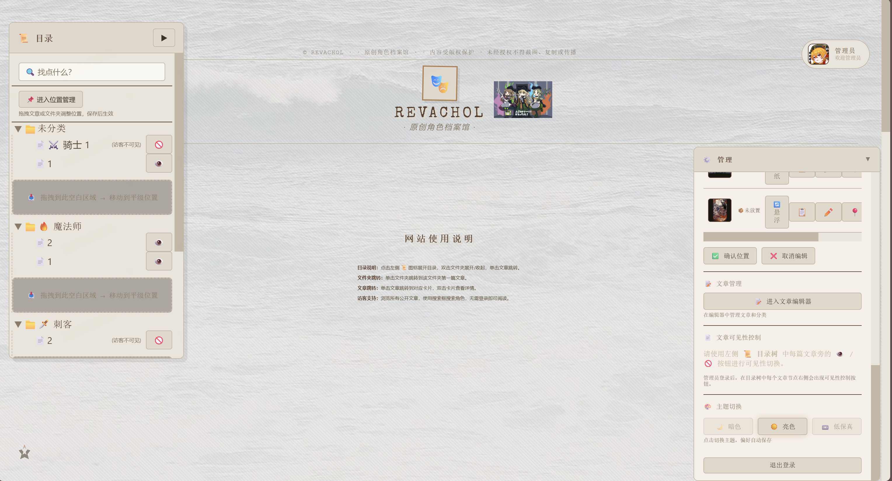
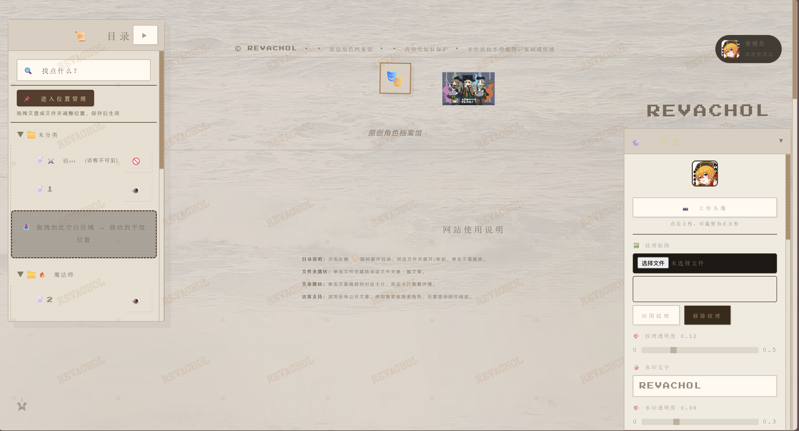
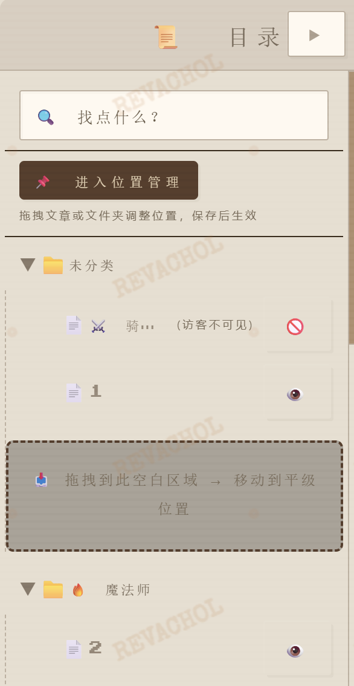
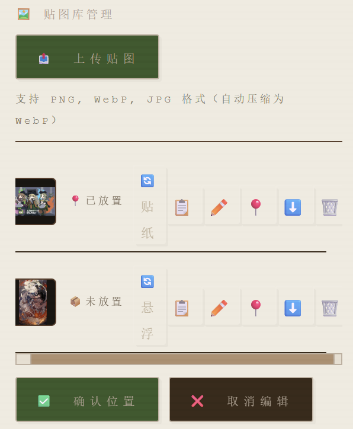
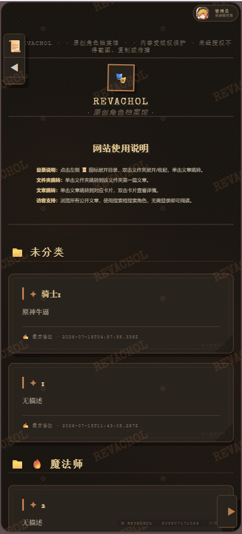

# REVACHOL

原创角色档案馆，一个带内容管理、贴纸装饰、水印保护、多主题切换的 Web 应用。

当前版本：v1.0.0

---

## 预览

| 主题 | 截图 |
|------|------|
| 暗色 |  |
| 亮色 |  |
| 低保真 |  |

| 功能 | 截图 |
|------|------|
| 目录树 |  |
| 贴纸系统 |  |
| 移动端 |  |

---

## 功能

- 文章：增删改查、分类管理、可见性控制、无限滚动
- 目录树：折叠展开、拖拽排序、右键菜单
- 详情页：标签页模式、全屏、最小化
- 贴纸：上传（自动压缩为 WebP）、管理、位置编辑
- 主题：暗色、亮色、低保真三套
- 管理面板：登录、头像、背景、纹理、水印、色卡
- 移动端：响应式布局、触摸拖拽、长按菜单

---

## 技术栈

前端：原生 ES Module、Vite、自研状态管理（AppState + EventBus）
后端：Node.js + 原生 http、SQLite、WebSocket
存储：本地文件系统 / S3 兼容对象存储（适配器模式切换）
监控：ErrPulse
测试：Vitest + jsdom

---

## 项目结构

```bash
revachol/
├── js/                        # 前端
│ ├── core/                    # 状态、事件、引用
│ ├── services/                # 业务逻辑
│ ├── ui/components/           # UI 组件
│ ├── admin/                   # 管理模块
│ └── utils/                   # 工具函数
├── css/                       # 样式（主题、响应式）
├── backend/                   # 后端
│ ├── routes/                  # 路由
│ ├── storage/                 # 存储适配器
│ └── uploads/decos/           # 贴纸文件
└── tests/                     # 单元测试
```

---

## 快速开始

环境：Node.js 18+

```bash
# 前端
npm install
npm run dev

# 后端
cd backend
npm install
node server.cjs
```

管理员账号：admin / admin123

### 存储配置

创建 backend/.env 文件：

STORAGE_TYPE=local

#### 或使用 S3 兼容存储
STORAGE_TYPE=rustfs
RUSTFS_ENDPOINT=http://localhost:9000
RUSTFS_ACCESS_KEY=minioadmin
RUSTFS_SECRET_KEY=minioadmin
RUSTFS_BUCKET=revachol

## 架构亮点

存储层适配器模式：本地文件系统与 S3 兼容存储无缝切换，业务代码零感知。

目录树模块化：从 400+ 行拆分为 12 个职责单一的模块。

单向数据流：ArticleService 为唯一数据源，ArticleListStore 派生数据无副本。

多主题系统：CSS 变量驱动，三套主题动态加载。

## 更新日志

### v1.3.0

**工程注释重构**：全项目 107 个文件删除装饰性分隔线与废话注释，新增 25+ 处工程决策注释，覆盖自研路由层 / 状态管理 / EventBus / ApiClient / 存储适配器等核心模块，标注技术债与已知限制。

**修复**：
- 贴纸存储恢复本地文件系统，修改 `.env` 一行可切换 RustFS
- 访客模式下文件夹折叠/展开修复（匿名监听器泄漏导致偶数抵消）
- 登出后头像实时切换为访客默认图片
- 登录后贴纸右键菜单恢复（DOM 移除改为隐藏）
- 访客模式下贴纸右键菜单禁用（权限守卫遗漏）
- `:scope > .children` 改为 `.children` 兼容更多浏览器

### v1.2.0

**工具栏**：左上角新增可展开工具栏，当前含使用说明组件。点击展开后在详情标签页中阅读网站说明，与文章阅读体验一致。

**卡片高亮**：点击目录树跳转到文章卡片时，显示主题自适应辉光动画（暗色暖金 / 亮色暖棕 / 低保真米褐），1.5 秒自动消退。

**详情页升级**：
- 铺满全屏，无边框间距与宽度限制
- 滚动隔离——阅读时不会触发外部页面滚动
- 顶部栏改为浏览器式标签行：标签页在左，最小化/全屏/关闭在右

**主题拆分**：三个主题文件拆分为 5 模块（变量 / 布局 / 内容 / 侧边栏 / 交互），按功能域定位。

**贴纸存储**：统一使用本地文件系统，`.env` 中 `STORAGE_TYPE=local`。

### v1.1.0

**实时通信**：主页面与文章编辑器页面之间通过 BroadcastChannel 实现可见性修改的实时同步，无需刷新。

**主题优化**：
- 暗色/亮色主题目录树字体补全（IM Fell English 古卷宗体）
- 低保真主题按钮全覆盖、标题居中、卡片重新设计为 6 种不规则裁剪 + SVG 撕纸边缘滤镜 + 透底纸张白纸配色
- 三个主题下登录入口尺寸统一增大，头像占比提升
- 目录树行距统一，消除访客/管理员模式切换时的布局跳动

**交互修复**：
- 贴纸右键菜单恢复（与目录树菜单 id 冲突已解决，两菜单完全独立并有三套主题样式）
- 访客↔管理员模式切换即时生效，目录树与文章列表自动刷新
- 文章编辑器页面加载稳定性提升（重复导入修复 + 安全超时 + 错误处理）

## 后续计划

补充 UI 自动化测试

文章全文搜索

Docker 部署

多语言支持
